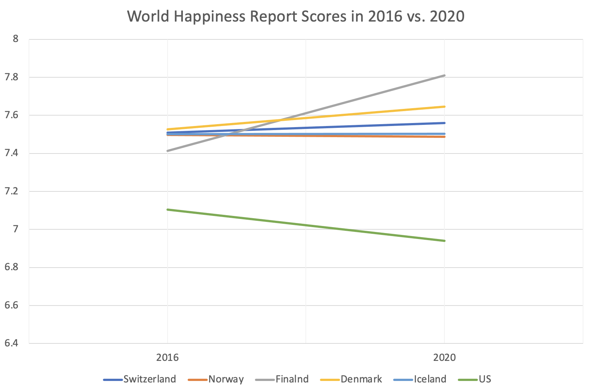
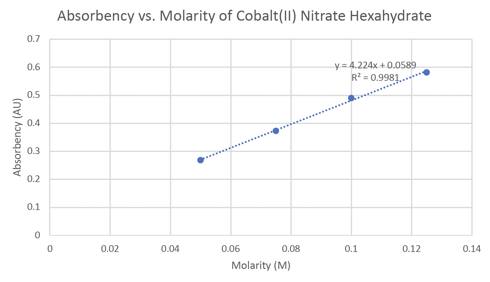
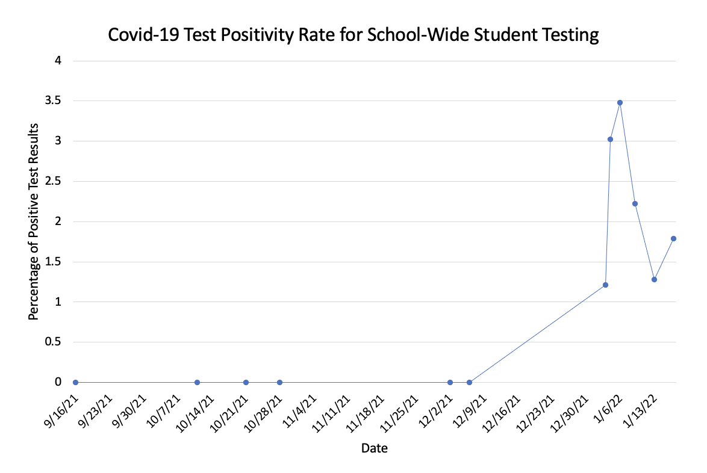
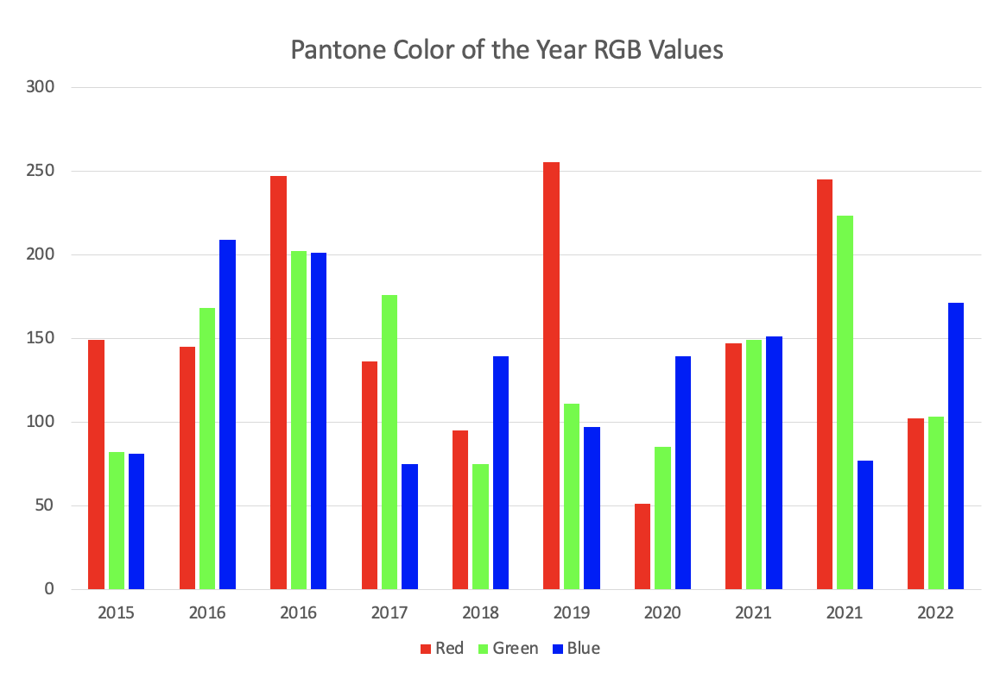
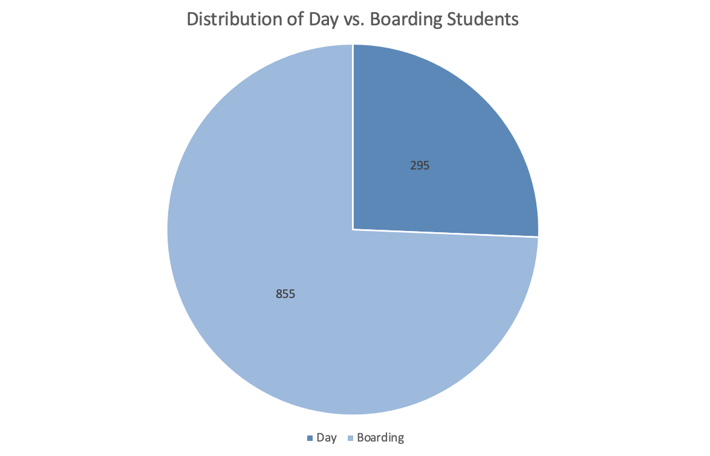

# Chart Challenge Portfolio

12/6/21 - Part-to-Whole  

12/8/21 - Pictogram  

12/10/21 - Pictogram  

12/13/21 - Historical  

12/15/21 - Magical  

1/7/21 - Slope  

1/10/21 - Experimental  

1/12/21 - Physical  

1/12/21 - Animals  

1/21/21 - Statistics  

1/24/21 - Abstract  

1/26/21 - Circular  

