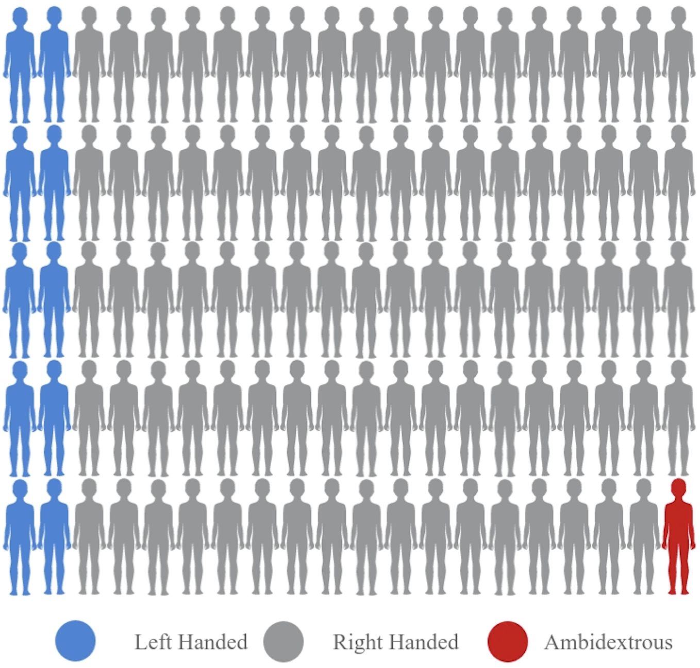
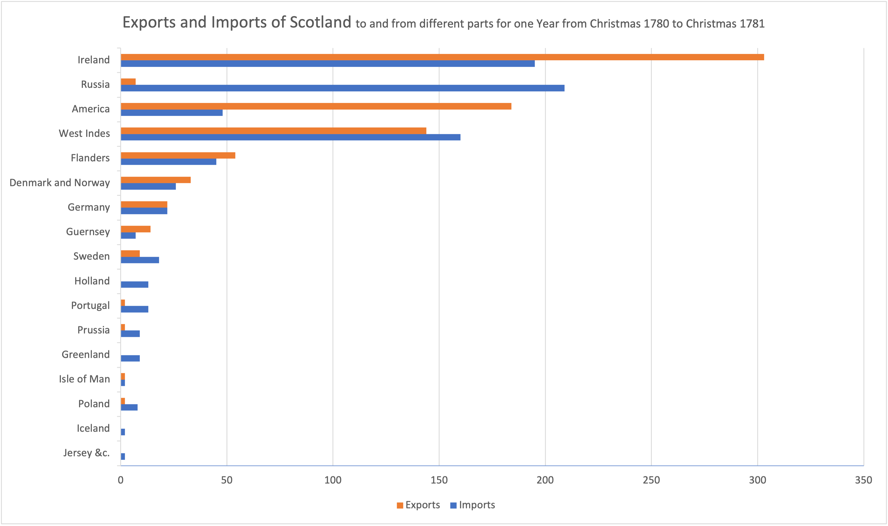
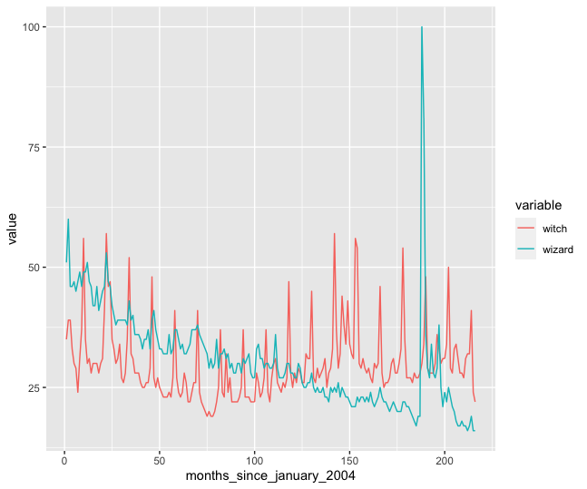
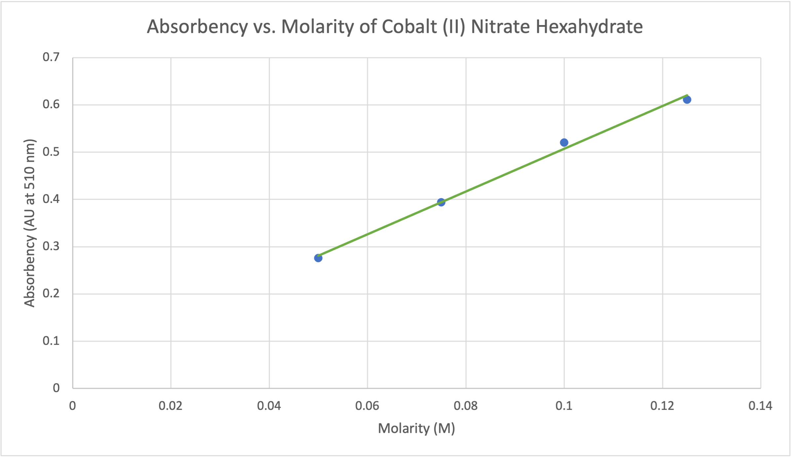
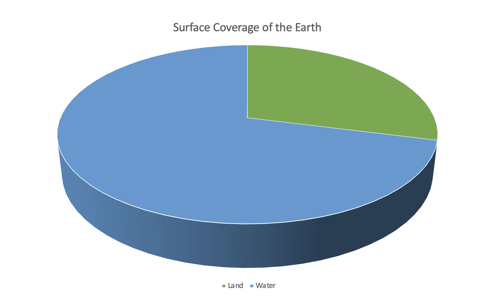
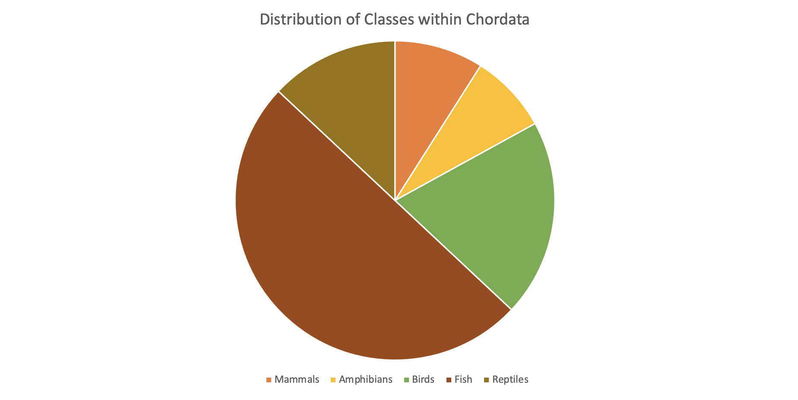
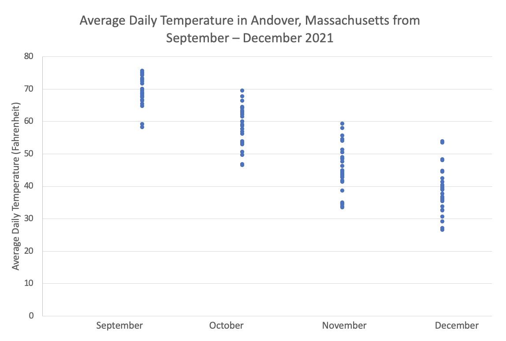
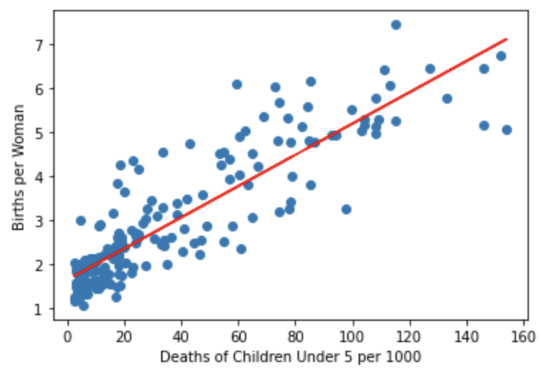
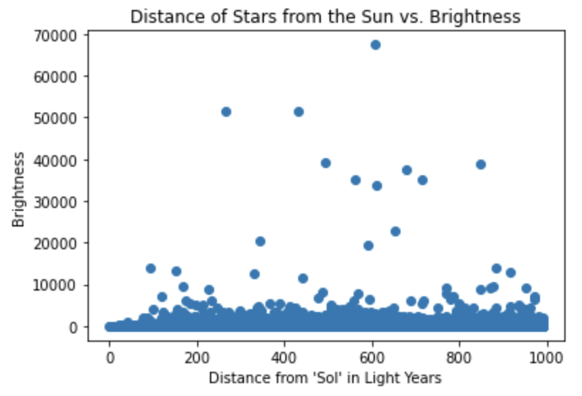
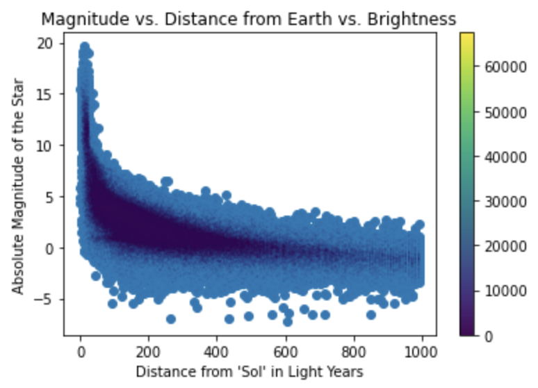

# Chart Challenge Portfolio

12/6/21 - Part-to-Whole  

12/8/21 - Pictogram  

12/10/21 - Pictogram  

12/13/21 - Historical  

12/15/21 - Magical  

1/7/22 - Slope  

1/10/22 - Experimental  

1/12/22 - Physical  

1/12/22 - Animals  

1/21/22 - Statistics  

1/24/22 - Abstract  

1/26/22 - Circular  

1/28/22 - Strips  

2/2/22 - Correlation  

2/11/22 - Space  

2/14/22 - Multivariate  

